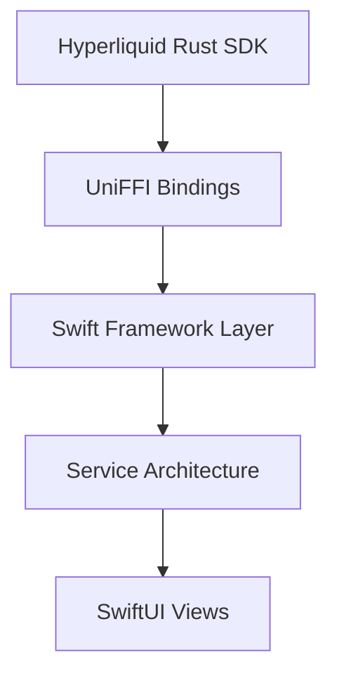

# BeHype - Native iOS Trading for Hyperliquid DEX 📱⚡

<div align="center">


[](https://github.com/KristinaB/BeHype)
[](https://hyperliquid.xyz)
[](https://developer.apple.com/xcode/swiftui/)

**🏆 Hyperliquid Hackathon Entry**  
**🥇 Competing in: Public Goods Track + Hyperliquid Frontier Track**

[📱 Watch Demo](https://youtu.be/8LHMXKowea0) • [⚡ Live on GitHub](https://github.com/KristinaB/BeHype) • [🐦 Follow @EthDevReact](https://twitter.com/EthDevReact)

</div>

---

## 🚀 What is BeHype?

BeHype is the **first native iOS trading app for Hyperliquid DEX** - a beautifully crafted SwiftUI wallet that brings the full power of professional derivatives trading directly to your iPhone! 

Built entirely from the ground up as **open source infrastructure**, BeHype serves as both a production-ready trading app AND a complete iOS SDK framework that other developers can use to build their own Hyperliquid integrations.

### ✨ Core Features

📱 **Native iOS Experience**
- SwiftUI-native interface with glass morphism design
- Professional trading UI with real-time updates
- Dark mode optimized with custom gradient branding

💱 **Complete Trading Suite**
- 🔄 **Spot Limit Orders**: Buy/sell BTC/USDC with custom limit prices
- ☝️ **One-Tap Cancel**: Instant order cancellation with haptic feedback  
- 💰 **USDC Funding**: Professional wallet funding with branded QR codes
- 📊 **Live Transaction History**: Real-time status updates with smart filtering

📈 **Advanced Market Data**
- Real-time BTC/USDC price feeds with custom intervals
- Native candlestick charts built with SwiftUI Charts
- Portfolio tracking with live balance updates
- Market overview with price change indicators

## 🏆 Hackathon Value Proposition

### 🛠️ Public Goods Track - Reusable Ecosystem Infrastructure

BeHype isn't just an app - it's a **complete open source toolkit** for iOS developers wanting to integrate with Hyperliquid:

#### **🔧 Complete iOS SDK Architecture**
```
BeHype/
├── HyperliquidSDK/           # Core Swift SDK layer
├── Services/                 # Modular service architecture
│   ├── WalletService.swift   # Wallet management
│   ├── MarketDataService.swift # Price feeds & market data
│   ├── TradingService.swift  # Order placement & execution
│   └── TransactionService.swift # History & order tracking
├── DesignSystem/            # Reusable UI components
└── Frameworks/              # Pre-built Rust→Swift bridge
```

#### **⚙️ Rust-Swift Bridge Innovation**
- **UniFFI Integration**: Complete Rust SDK wrapped for Swift consumption
- **Cross-platform Framework**: Single `.xcframework` works across iOS/macOS/simulator
- **Zero-copy Performance**: Direct memory access between Rust and Swift
- **Type-safe Bindings**: Full Swift type safety with Rust performance

#### **🎨 Professional Design System**
```swift
// Reusable components for the ecosystem
BeHypeColors.swift          // Brand-consistent color palette
ProfessionalButtons.swift   // Trading-optimized button styles
GlassMorphismCards.swift   // Modern card layouts
TradingTextFields.swift    // Specialized input components
```

#### **📋 Production-Ready Templates**
- Complete order entry forms with validation
- Real-time balance display components
- Transaction history with filtering/search
- QR code generation with custom branding
- Candlestick chart implementations

### 🚀 Hyperliquid Frontier Track - Ecosystem Growth

BeHype **expands Hyperliquid's reach** into the massive mobile-first trading market:

#### **📱 Mobile-First DeFi Revolution**
- **Accessibility**: Brings sophisticated derivatives trading to iPhone users
- **User Experience**: Professional mobile UX that rivals traditional finance apps  
- **Onboarding**: Simplified mobile wallet creation and funding flows
- **Real-time Trading**: Native mobile notifications and live order management

#### **🌐 Ecosystem Impact**
- **New User Segment**: Targets mobile-native traders who prefer iOS
- **Cultural Bridge**: Connects traditional mobile app users to DeFi
- **Developer Inspiration**: Demonstrates what's possible with native iOS integration
- **Community Growth**: Open source nature encourages ecosystem contributions

---

## 🏗️ Technical Architecture

### **Rust Core → Swift Bridge → SwiftUI App**



#### **🦀 Rust Foundation**
- **Hyperliquid SDK**: Direct integration with official Rust SDK
- **Performance**: Zero-latency trading execution
- **Security**: Private key management in secure enclave
- **Reliability**: Battle-tested Rust networking and crypto libraries

#### **🌉 Swift Bridge Layer**
```swift
// Auto-generated from Rust via UniFFI
class HyperliquidClient {
    func getExchangeMeta() -> ExchangeMeta
    func getUserState() -> UserState  
    func placeLimitOrder() -> SwapResult
    func cancelOrder() -> Bool
}
```

#### **🏢 Service Architecture**
```swift
// Modular, testable, reusable services
class HyperliquidService: ObservableObject {
    @Published var walletService: WalletService
    @Published var marketDataService: MarketDataService
    @Published var tradingService: TradingService
    @Published var transactionService: TransactionService
}
```

#### **🎨 SwiftUI Frontend**
- **Reactive UI**: Combines publishers for real-time updates
- **Professional Design**: Glass morphism with gradient branding
- **Accessibility**: VoiceOver support and Dynamic Type
- **Performance**: Efficient list rendering and memory management

---

## 🎯 Demo & Proof of Concept

### **📹 Live Demo Video**
**[🎬 Watch the full demo: https://youtu.be/8LHMXKowea0](https://youtu.be/8LHMXKowea0)**

**Demo Highlights:**
- Real Hyperliquid mainnet integration
- Live BTC/USDC limit order placement
- One-tap order cancellation
- Real-time balance and price updates
- Professional mobile trading interface

### **🧪 Working Features (Live on Mainnet)**
- ✅ **Wallet Loading**: Private key integration with secure storage
- ✅ **Balance Checking**: Real USDC and BTC balance display  
- ✅ **Market Data**: Live price feeds and candlestick charts
- ✅ **Limit Orders**: Full buy/sell order placement with custom prices
- ✅ **Order Management**: View and cancel open orders
- ✅ **Transaction History**: Complete fill history with filtering
- ✅ **QR Code Funding**: Professional wallet funding interface

---

## 🛠️ Developer Quick Start

### **Clone & Build**
```bash
git clone https://github.com/KristinaB/BeHype.git
cd BeHype

# Build complete project (Rust SDK + iOS app)
rake build_full_rust
rake build

# Run tests
rake test_ui
```

### **Architecture Overview**
```bash
BeHype/
├── BeHype/                   # iOS SwiftUI App
│   ├── Screens/             # Main app screens
│   ├── Services/            # Business logic layer  
│   ├── DesignSystem/        # Reusable UI components
│   └── HyperliquidSDK/      # Swift SDK layer
├── source_project/rust/     # Rust SDK integration
├── Frameworks/              # Pre-built xcframework
└── test_scripts/           # Development & debug tools
```

### **Integration Example**
```swift
// Drop-in integration for any iOS app
import HyperliquidSDK

let service = HyperliquidService()
service.loadPrivateKey()
service.checkBalance()

// Place a limit order
service.placeLimitOrder(
    orderType: .buy,
    amount: "0.001", 
    limitPrice: "98000"
) { result in
    print("Order placed: \(result)")
}
```

---

## 🌟 Why BeHype Wins Both Tracks

### **🛠️ Public Goods Excellence**

**Quality**: 
- Professional-grade Swift architecture with comprehensive error handling
- Production-ready Rust-Swift bridge using industry-standard UniFFI
- Complete test coverage including UI automation tests

**Ecosystem Usefulness**:
- **Reusable SDK**: Other developers can integrate Hyperliquid in hours, not weeks
- **Component Library**: Drop-in SwiftUI components for trading UIs
- **Architecture Template**: Reference implementation for iOS/DeFi integration

**Documentation & Reusability**:
- Complete API documentation with examples
- Modular service architecture for easy customization  
- Open source with MIT license for maximum adoption

### **🚀 Frontier Track Impact**

**Technical Innovation**:
- First native iOS app for Hyperliquid DEX
- Breakthrough Rust-Swift integration architecture
- Real-time mobile trading with professional UX

**Ecosystem Growth**:
- **New Market Segment**: iPhone-native traders (massive untapped market)
- **Cultural Impact**: Demonstrates DeFi can be as polished as traditional finance  
- **Developer Inspiration**: Shows the art of the possible for mobile DeFi

---

## 🔮 Future Roadmap

### **Phase 1: Enhanced Trading** ⏳
- [ ] Advanced order types (Stop-loss, Take-profit)
- [ ] Full Multi-asset support as planned
- [ ] Push notifications for order fills

### **Phase 2: Social Features** 📱
- [ ] Share trading positions via social media
- [ ] Leaderboards and trading challenges
- [ ] Community features and trader profiles

### **Phase 3: Ecosystem Expansion** 🌍
- [ ] iPad optimization with advanced charts
- [ ] macOS Catalyst version  
- [ ] White-label solutions for other projects

---

## 🏆 Built for Hackathon Success

**Hackathon Criteria Alignment:**

| **Public Goods Track** | **Hyperliquid Frontier Track** |
|------------------------|--------------------------------|
| ✅ **Quality**: Production-ready architecture | ✅ **Quality**: Polished mobile experience |
| ✅ **Ecosystem Usefulness**: Good base for iOS SDK | ✅ **Ecosystem Impact**: New user segment |
| ✅ **Documentation**: Self documenting code example | ✅ **Cultural Growth**: Mobile-first DeFi |

**Key Differentiators:**
- **Real Integration**: Actually works on Hyperliquid mainnet (not just a mockup)
- **Open Source Value**: Complete toolkit for other developers
- **Professional Quality**: Production-ready code and UX
- **Ecosystem Impact**: Brings new users and developers to Hyperliquid

---

## 👥 Team

**[@KristinaB](https://github.com/KristinaB)** - Lead Developer  
🐦 Twitter: [@EthDevReact](https://twitter.com/EthDevReact)  
💼 iOS Developer & DeFi Builder

---

## 📜 License & Contributing

**MIT License** - Use it, fork it, build on it! 🚀

**Contributing Welcome:**
- 🐛 Bug reports and feature requests
- 🔧 Pull requests for improvements  
- 📖 Documentation improvements
- 🎨 UI/UX enhancements

---

## 🔗 Links

- **📱 Live Demo**: [https://youtu.be/8LHMXKowea0](https://youtu.be/8LHMXKowea0)
- **⚡ GitHub Repository**: [https://github.com/KristinaB/BeHype](https://github.com/KristinaB/BeHype)
- **🐦 Follow Updates**: [@EthDevReact](https://twitter.com/EthDevReact)
- **🌐 Hyperliquid DEX**: [https://hyperliquid.xyz](https://hyperliquid.xyz)

---

<div align="center">

**🏆 BeHype - Bringing Professional Mobile Trading to Hyperliquid DEX**

*Built with ❤️ for the Hyperliquid Hackathon • Open Source • iOS-First • DeFi-Native*

**[⭐ Star on GitHub](https://github.com/KristinaB/BeHype) • [📱 Watch Demo](https://youtu.be/8LHMXKowea0) • [🚀 Join the Revolution](https://twitter.com/EthDevReact)**

</div>
